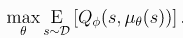
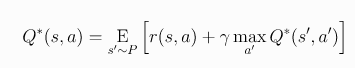
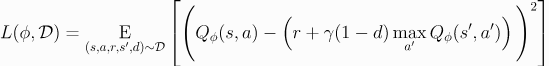
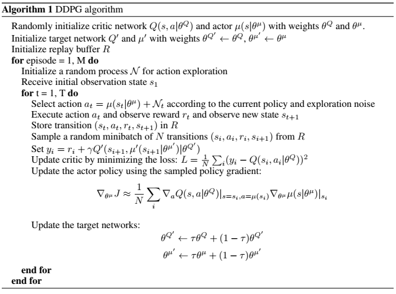
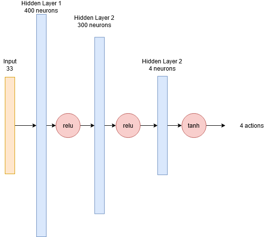
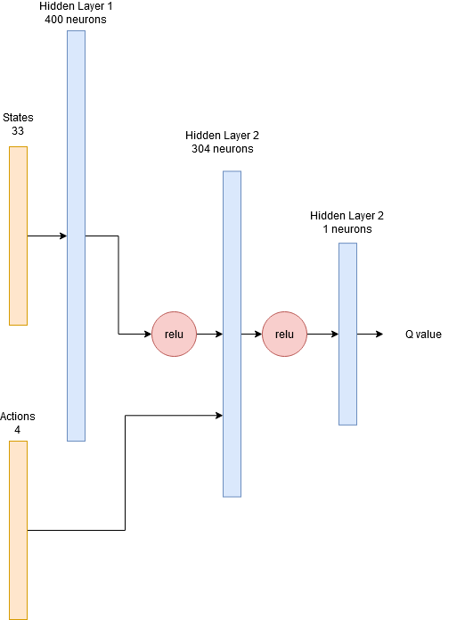
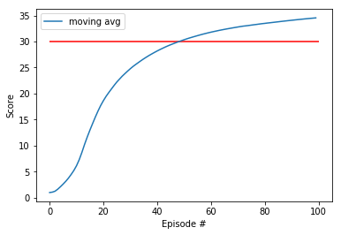

# Project 2: Continuous Control

* [Introduction](#introduction)
* [Learning Algorithm](#learning-algorithm)   
* [Project Structure](#project-structure)   
* [Implementation](#implementation)   
* [Results](#results)   
* [Future work](#ideas-for-future-work)

## Introduction

In this environment, a double-jointed arm can move to target locations. A reward of +0.1 is provided for each step that the agent's hand is in the goal location. Thus, the goal of your agent is to maintain its position at the target location for as many time steps as possible.

In order to solve the environment, our agent must achieve a score of +30 averaged across all 20 agents for 100 consecutive episodes.

To solve this task, I implemented the [DDPG algorithm](https://arxiv.org/pdf/1509.02971.pdf) algorithm. This algorithm is suitable to solve complex, high-dimensional tasks in the continuous domain. First, I cover some details of the algorithm for my understanding and give the reader background information. Then the implementation details and hyperparameters are explained. Finally, the results are presented. 


## Learning Algorithm

> DDPG combines the actor-critic approach with the insights from the Deep Q Network. DQN learn value functions 
> using deep neural networks in a stalbe and robust way. They utilize a replay buffer to minimize correlations between samples
> and a target Q network. DDPG is model free, off policy actor-critic algorithm that can learn high-dimensional, continuous action spaces.  
> The authors of the [the paper](https://arxiv.org/pdf/1509.02971.pdf) highlight that DDPG can be viewed as an extension of Deep Q-learning to continuous tasks.


* **Policy-based**: Unlike its value-based counterparts (like DQN), this method tries to
  learn the policy that the agent should use to maximize its objective directly. Recall
  that value-based methods (like Q-learning) try to learn an action-value function 
  to then recover the implict policy (greedy policy).

* **Actor-critic**: Actor-critic methods leverage the strengths of both policy-based and value-based methods.
  Using a policy-based approach, the agent (actor) learns how to act by directly estimating the optimal policy and maximizing reward through gradient ascent.     
  Meanwhile, employing a value-based approach, the agent (critic) learns how to estimate the value (i.e., the future cumulative reward) of different state-action 
  pairs. Actor-critic methods combine these two approaches in order to accelerate the learning process. Actor-critic agents are also more stable than value-based 
  agents, while requiring fewer training samples than policy-based agents.

* **Model-free**: We do not need access to the dynamics of the environment. This algorithm
  learns the policy using samples taken from the environment. We learn the action-value function
  (critic) by using *Q-learning* over samples taken from the world, and the policy by
  using the *Deterministic Policy Gradients* theorem over those samples.

* **Off-policy**: The sample experiences that we use for learning do not necessarily come
  from the actual policy we are learning, but instead come from a different policy (exploratory
  policy). As in DQN, we store these experiences in a replay buffer and learn from
  samples of this buffer, which might come from different timesteps (and potentially from
  different versions of the exploratory policy).
  
In DDPG the actor is the policy based part and the critic is the Q-learning part. 
To learn the actor function <a href="https://www.codecogs.com/eqnedit.php?latex=\mu(s|\theta^Q)" target="_blank"></a> the DDPG algorithm performs gradient ascend w.r.t parameters to solve 




The critic Q(s,a) can learned by considering the Bellman equation



which describes the optimal action value function. 
The loss function to learn the optimal action value function is 



This mean squared loss function provides us with the information, how close the critic Q(s,a) comes to fullfill the Bellman equation. 

To explore the continous action space, a exploration policy is used:

<a href="https://www.codecogs.com/eqnedit.php?latex=\mu'&space;=&space;\mu(s|\theta^Q)&space;&plus;&space;\mathcal{N}" target="_blank"></a>

This policy adds to action from the actor function a noise sampled from a noise process. 

After we have covered the ideas behind the DDPG here is the full algorithm 

  
  
## Project Structure

The code is written in PyTorch and Python3, executed in Jupyter Notebook

- Continuous_Control.ipynb	: Training and evaluation of the agent
- ddpgagent.py	: An agent that implement the DDPG algorithm
- models.py	: DNN models for the actor and the critic
- replaybuffer.py : Implementation of experience replay buffer
- checkpoint.pt : parameters for actor/critic network


## Implementation

The DDPGAgent class implements the DDPG algorithm. It creates during its initialization the local and target critic/actor networks. 
It sets up the replay buffer and creates the noise process. 

The act method returns the action obtained from the actor. During training noise is added for the exploration.
The step method is called with the current state, next state and reward. The experience is stored in the replay buffer. 
If enough data is collected, the agent learns by perform gradient steps for the actor/critic in the learn method. 

In my first approach i learned at each step, which lead to a long training time and the agent can't solve
the task. I changed the learning intervals based on the suggestions from the course. The agent learn in 20 episode intervals 10 times. 
This improved the learning a lot. 


After changing the learning interval, the agent started to gain a better score, but then the score started to drop or improved not further.
I did some research and read the project information from the course. It seems to be the case the gradients explode. 
I added gradient clipping to the critic training. Now the agents stopped to stuck or drop the scores.

After these improvements, the agent started to learn, but the progress is still slow. I tried different learning rates and batch sizes, 
which lead to the final batch size of 1024 samples.


After the gradients and the new parameters computed, the target networks are updated with a soft update. 

### Models


#### Actor


#### Critic



### Hyperparameters


```python
OU_SIGMA = 0.2          # Ornstein-Uhlenbeck noise parameter
OU_THETA = 0.15         # Ornstein-Uhlenbeck noise parameter
tau = 0.01
Actor learning rate = 1e-3
Critic learning rate = 1e-3
Gamma = 0.99
learn interval = 20
Epsilon = 1
Epsilon decay = 0.99
BATCH_SIZE = 1024
BUFFER_SIZE = 1e6
```

### Results

Using the training setup described in the previous section, the training script is able to yield a consistent solving of the environment under 150 episodes.



## Ideas for Future Work


1. Implement the D4PG, A3C algorithm and compare with this DDPG performance
2. Implement a prioritised Replay buffer

## References

* [1] [Sutton, Richard & Barto, Andrew. *Reinforcement Learning: An introduction.*](http://incompleteideas.net/book/RLbook2018.pdf)
* [2] [*Continuous control through deep reinforcement learning* paper by Lillicrap et. al.](https://arxiv.org/pdf/1509.02971.pdf)
* [3] [*Deterministic Policy Gradients Algorithms* paper by Silver et. al.](http://proceedings.mlr.press/v32/silver14.pdf)
* [4] [Post on *Deep Deterministic Policy Gradients* from OpenAI's **Spinning Up in RL**](https://spinningup.openai.com/en/latest/algorithms/ddpg.html)
* [5] [Post on *Policy Gradient Algorithms* by **Lilian Weng**](https://lilianweng.github.io/lil-log/2018/04/08/policy-gradient-algorithms.html)
* [6] [A Gentle Introduction to Exploding Gradients in Neural Networks](https://machinelearningmastery.com/exploding-gradients-in-neural-networks/)
